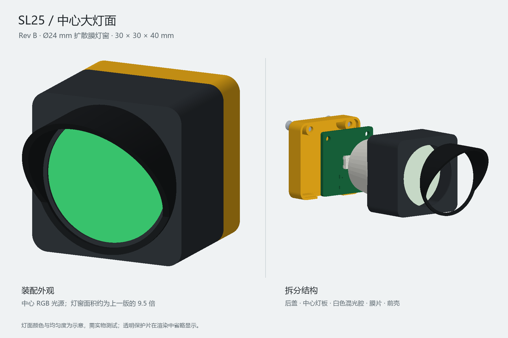

# Pilot Light

一个紧凑型 USB RGB 状态信号灯的开源硬件项目。当前设计版本为 **SL25 Rev B**：通过 CH552G 控制一颗位于正面中心的 WS2812B-V5，使用单个直径 24 mm 的扩散灯窗显示红、黄、绿等状态。

> 本仓库包含可编辑的 PCB、外壳和制造文件，但尚未完成实物打样、光学测试、USB 功能验证或电脑状态采集软件。制造与使用前请自行复核并完成测试。

## 当前设计

| 项目 | SL25 Rev B 规格 |
| --- | --- |
| PCB | 25 x 25 mm、双层、1.6 mm 厚 |
| 光源 | 正面中心 WS2812B-V5 RGB LED |
| 控制器 | CH552G，LED 数据输出为 P1.5 |
| 接口 | 背面 USB-C，USB 2.0 全速原型电路 |
| 外壳 | 30 x 30 x 40 mm |
| 灯窗 | 正面中心直径 24 mm，PET 扩散膜与透明 PC 保护片 |
| 遮光檐 | 顶部前伸 15 mm，两侧连续收短 |

该设计的光学结构从外到内依次为：黑色遮光帽、透明 PC 保护片、PET 扩散膜、泡棉压圈、白色混光腔与中心 RGB LED。白色混光腔是获得较均匀光效的必要零件，不能以黑色打印件替代。

## 仓库结构

| 路径 | 内容 |
| --- | --- |
| [`hardware/sl25_rev_b/`](hardware/sl25_rev_b/) | 当前 Rev B KiCad 工程、BOM、Gerber、贴片坐标、3D 模型与检查报告 |
| [`enclosure/sl25_traffic_rev_b/`](enclosure/sl25_traffic_rev_b/) | 当前 Rev B FreeCAD 工程、STEP、STL、光学片裁切模板与装配说明 |
| [`firmware/ch552_ws2812_demo/`](firmware/ch552_ws2812_demo/) | 用于焊后点灯检查的最小 CH552G 示例程序 |
| [`hardware/reference/`](hardware/reference/) | 器件数据手册和参考图纸 |
| [`SL25-RevB-complete.zip`](SL25-RevB-complete.zip) | Rev B 完整交付包 |
| [`hardware/SL25-RevB-gerbers.zip`](hardware/SL25-RevB-gerbers.zip) | Rev B PCB 制板文件包 |
| [`enclosure/SL25-Traffic-STL-RevB.zip`](enclosure/SL25-Traffic-STL-RevB.zip) | Rev B 3D 打印和膜片裁切文件包 |

`hardware/sl25/` 与 `enclosure/sl25_traffic/` 为历史 Rev A 文件，仅供参考。Rev A 和 Rev B 的 LED、元件安装面、外壳及控制方式不兼容，不能混用。

## 制造与装配

1. 使用 `hardware/SL25-RevB-gerbers.zip` 下单 PCB；建议规格为 FR-4、2 层、1.6 mm、1 oz 铜。
2. 根据 [`hardware/sl25_rev_b/BOM.csv`](hardware/sl25_rev_b/BOM.csv) 和 [`MATERIALS.md`](hardware/sl25_rev_b/MATERIALS.md) 采购并装配；所有元件和 USB-C 均在 PCB 背面，只有 WS2812B-V5 位于正面。
3. 打印 Rev B 的四个外壳件。前壳和遮光帽使用黑色材料，混光腔必须使用不透光白色材料；建议 PETG、0.4 mm 喷嘴、0.16-0.20 mm 层高。
4. 按 `cut_templates/` 中 1:1 SVG 裁切直径 26 mm 的透明 PC 保护片、PET 扩散膜和泡棉环；先测量模板中的 10 x 10 mm 校准框。
5. 参考 [外壳装配说明](enclosure/sl25_traffic_rev_b/README.md) 完成装配。需要两颗 M2 x 12、头径不超过 4.0 mm 的 90 度沉头螺丝。
6. 使用 [`firmware/ch552_ws2812_demo/`](firmware/ch552_ws2812_demo/) 的台架程序确认红、绿、蓝、黄依次点亮，再进行完整功能开发。

完整尺寸、材料规格、打印方向、光学叠层和拆装步骤见 [外壳 README](enclosure/sl25_traffic_rev_b/README.md)。电路、USB/LED 引脚、制造规则和检验结果见 [PCB README](hardware/sl25_rev_b/README.md)。

## 开发与重建

- PCB 使用 KiCad 10。更新设计时，先保留手工修改，再依次运行 `hardware/generate_rev_b.py`、`hardware/route_rev_b.py` 和 `hardware/finish_board.py`；这些生成流程会覆盖已有输出。
- 外壳使用 FreeCAD。修改 `enclosure/sl25_traffic_rev_b/parameters.json` 后，依次运行 `build.py`、`finish_cad.py`、`render.py` 和 `cut_templates.py`。
- 固件使用 SDCC，并需要 WCH CH55X EVT 提供的启动文件。示例程序只用于点灯检查，正式固件应加入 USB 枚举、主机命令超时关灯、USB 挂起关灯和看门狗。

## 验证状态与限制

仓库中的 ERC、DRC、制造文件、模型资产和几何干涉检查已通过，但以下事项尚待实物确认：

- USB 电气性能、枚举和 USB-C 兼容性
- LED 的 WS2812 时序、功耗、温升和各颜色亮度
- 扩散膜下的均匀度、色斑和黄色配比
- 3D 打印公差、膜材厚度、螺丝配合和机械耐久

本项目不是通过认证的交通信号灯，也不应在安全关键或监管用途部署。

## 许可证

尚未指定许可证。在许可证补充前，请先联系仓库所有者确认使用、修改和分发权限。
